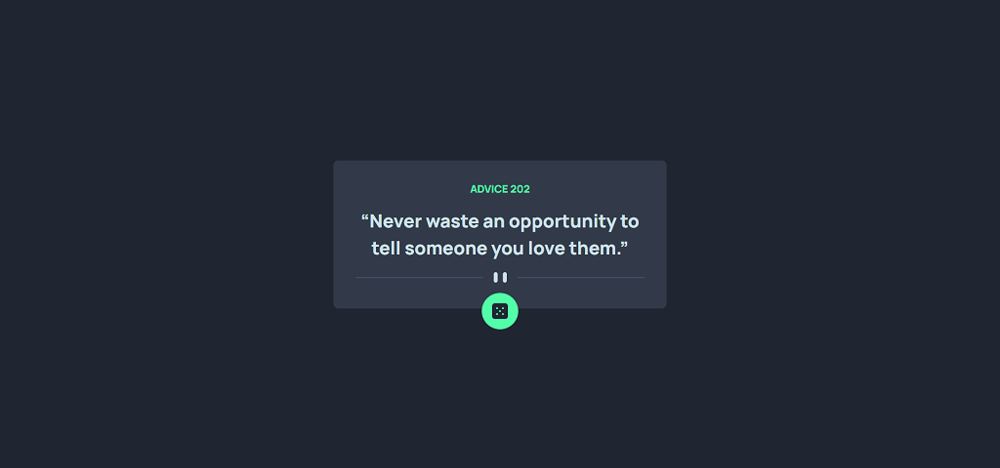
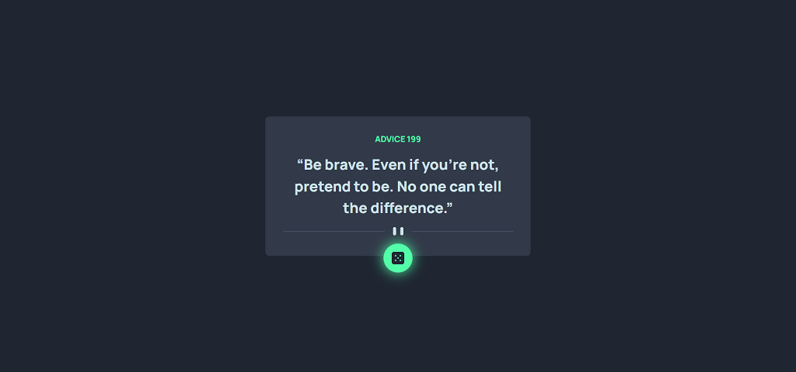
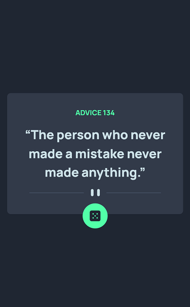

# Frontend Mentor - Advice generator app solution

This is a solution to the [Advice generator app challenge on Frontend Mentor](https://www.frontendmentor.io/challenges/advice-generator-app-QdUG-13db). Frontend Mentor challenges help you improve your coding skills by building realistic projects.

## Table of contents

- [Overview](#overview)
  - [Screenshot](#screenshot)
  - [Links](#links)
- [My process](#my-process)
  - [Built with](#built-with)
  - [What I learned](#what-i-learned)
- [Author](#author)
- [Acknowledgments](#acknowledgments)

## Overview

### Screenshot

### Links

- Solution URL: [Github Repo](https://github.com/to-my-learning-path/advice-generator-app)
- Live Site URL: [Github Pages](https://to-my-learning-path.github.io/advice-generator-app)

## My process

### Built with

- Semantic HTML5 markup
- Flexbox
- Mobile-First Approach
- TailWind CSS
- React
- SWR

### What I learned

I learned how to use SWR to call the API and display the results.

## Author

- Frontend Mentor - [@Omar](https://www.frontendmentor.io/profile/to-my-learning-path)
